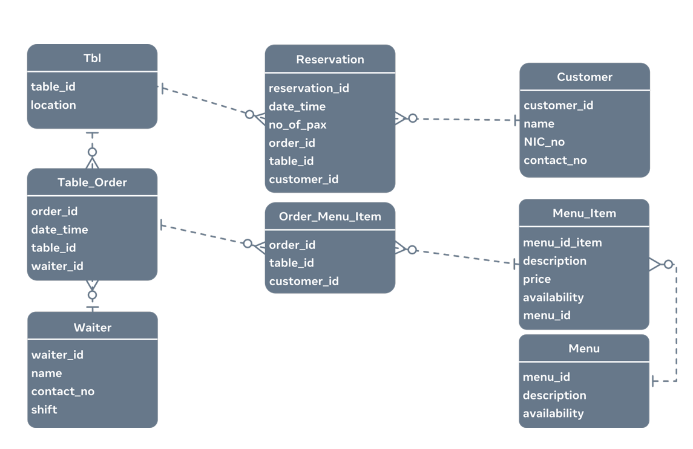

# Building a schema

In this reading, you’ll be taken through an example of building a simple database schema. You’ve learned about the concept of a database schema and what needs to be done to build it. The main objective of this reading is to present a more complex example of building a database schema.

It is highly recommend that you follow along and write the code in a MySQL environment on your own machine so you can see the schema you are building.

## Database schema
Building a database schema is the first step in database design. It is essential especially when you are dealing with relational databases because you want a solid structure for your database before you can move forward. A database schema is like a blueprint of how data in a database will look and be stored. 

A schema consists of what’s known as schema objects. Schema objects could be things like tables, columns and relationships, at a minimum. Data types, views, stored procedures, primary keys and foreign keys are also schema objects.

Basically, a database schema consists of:

* all the important data pertaining to a given scenario and their relationships, 

* unique keys for all entries and database objects, 

* and a name and data type for each column in a table. 

## Building a database schema for a restaurant booking scenario

When building a database schema for a restaurant booking system there are a few things you must consider. You must consider that customers make reservations for tables and those tables have orders associated with them. An order will have associated menu items that belong to a menu. And the orders are served by a waiter. 

## The logical database schema

Now let’s examine how to build a logical database schema for this scenario. In an example like this, database engineers usually draw a diagram known as ER-D (Entity Relationship Diagram).

The logical database schema consists of entities that become tables in the physical database design. Each entity has a set of attributes and one of them (sometimes even two) makes each entity instance, or row of data, unique. These attributes are known as the primary key. These primary key attributes are also present in other tables that the table relates to. In the related table, this key is known as the foreign key.

This is the logical schema or the ER-D for the scenario.



## The physical database schema

Now let’s build the physical database schema for this scenario based on the logical database schema that was designed in the previous section. The first step is to create the restaurant database.

To create the restaurant database, the CREATE DATABASE SQL syntax is as follows:

* CREATE DATABASE restaurant;

The next step is to create the tables inside this database. The tables and their fields or columns that need to be created are found in the logical database schema. Appropriate data types must be used when defining table columns. This enables memory allocation to take place correctly during physical data storage.

So, let’s examine the syntax for creating each table.

The first table ‘tbl’ represents a tablein the restaurant. It has a unique ID and a location – where it’s placed in the restaurant. The unique ID is the primary key of this table.

```SQL
CREATE TABLE tbl( 

    table_id INT, 

    location VARCHAR(255), 

    PRIMARY KEY (table_id) 

); 
```

---

This next table contains data about waiters who work in the restaurant. They have a unique ID, a name, their contact number and which shift they usually work. The primary key of the table is the unique ID assigned to the waiter.   

```SQL
CREATE TABLE waiter( 

    waiter_id INT, 

    name VARCHAR(150), 

    contact_no VARCHAR(10), 

    shift VARCHAR(10), 

    PRIMARY KEY (waiter_id) 

); 
```

---

The following syntax creates the table that stores data about orders for each table. It has the order ID and table ID fields. As well as a date_time field to capture the date and time of the order and the ID of the waiter who’s supposed to serve that table, for that order.


```SQL
CREATE TABLE table_order( 

    order_id INT, 

    date_time DATETIME, 

    table_id INT, 

    waiter_id INT, 

    PRIMARY KEY (order_id), 

    FOREIGN KEY (table_id) REFERENCES tbl(table_id), 

    FOREIGN KEY (waiter_id) REFERENCES waiter(waiter_id) 

); 
```

---

This table stores data about customers. It has a customer ID, name, NIC number to store the National Identity Card number and the contact number fields. The primary key is the unique customer ID field.


```SQL
CREATE TABLE customer( 

    customer_id INT, 

    name VARCHAR(100), 

    NIC_no VARCHAR(12), 

    contact_no VARCHAR(10), 

    PRIMARY KEY (customer_id) 

); 
```

---

The reservation table associates an order with a customer. It has a unique ID, a date and time, number of guests or pax expected, the order_id, table_id and the customer_id. Its primary key is the unique reservation_id. This table is linked with the tbl, table_order and customer tables.


```SQL
CREATE TABLE reservation( 

    reservation_id INT, 

    date_time DATETIME, 

    no_of_pax INT, 

    order_id INT, 

    table_id INT, 

    customer_id INT, 

    PRIMARY KEY (reservation_id), 

    FOREIGN KEY (order_id) REFERENCES table_order(table_id), 

    FOREIGN KEY (table_id) REFERENCES tbl(table_id), 

    FOREIGN KEY (customer_id) REFERENCES customer(customer_id) 

); 
```

---

This menu table stores all the menus of the restaurant. It has a menu_id which is the unique field that contains descriptions of the menu and its availability.


```SQL
CREATE TABLE menu( 

    menu_id INT, 

    description VARCHAR(255), 

    availability INT, 

    PRIMARY KEY (menu_id) 

); 
```

---

Every menu can have unique menu items and these menu items are stored against the menu, in the menu_item table. A menu items also has description, price and availability fields. This table links with the menu table.

```SQL
CREATE TABLE menu_item( 

    menu_item_id INT, 

    description VARCHAR(255), 

    price FLOAT, 

    availability INT, 

    menu_id INT, 

    PRIMARY KEY (menu_item_id), 

    FOREIGN KEY (menu_id) REFERENCES menu(menu_id) 

); 
```

---

This final table captures the menu items ordered for a specific order. It has the order_id, menu_item_id and the quantity ordered. It has a composite primary key of order_id and menu_item_id field combination and its linked with the table_order and menu_item tables.

```SQL
CREATE TABLE order_menu_item( 

    order_id INT, 

    menu_item_id INT, 

    quantity INT, 

    PRIMARY KEY (order_id,menu_item_id), 

    FOREIGN KEY (order_id) REFERENCES table_order(order_id), 

    FOREIGN KEY (menu_item_id) REFERENCES menu_item(menu_item_id) 

); 
```
---

These CREATE TABLE statements create all the tables within the reservation database. The important thing to note is how the relationships are established between the tables. Each table is defined with a primary key, and that in turn becomes the foreign key in the related table.

In conclusion, this is how a basic database structure or schema can be created using SQL DDL (Data Definition Language) syntaxes.